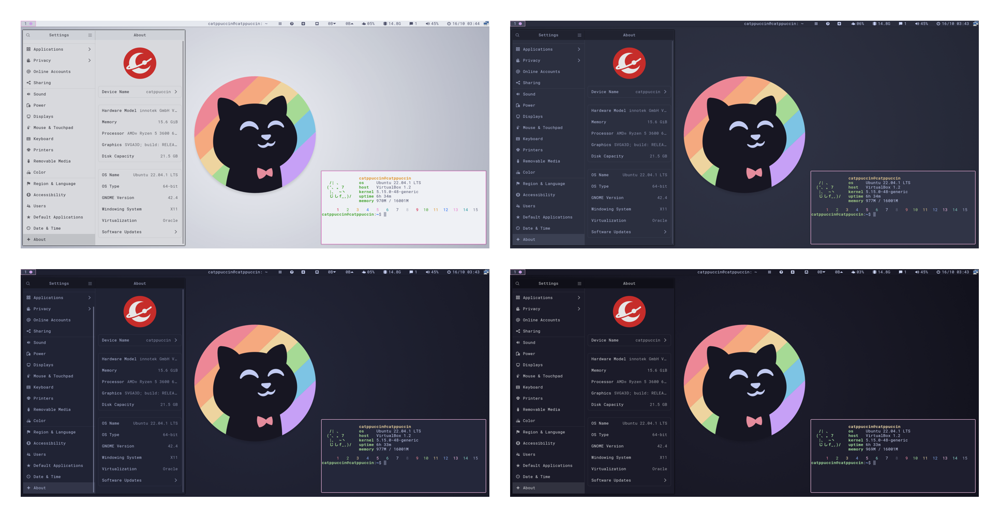
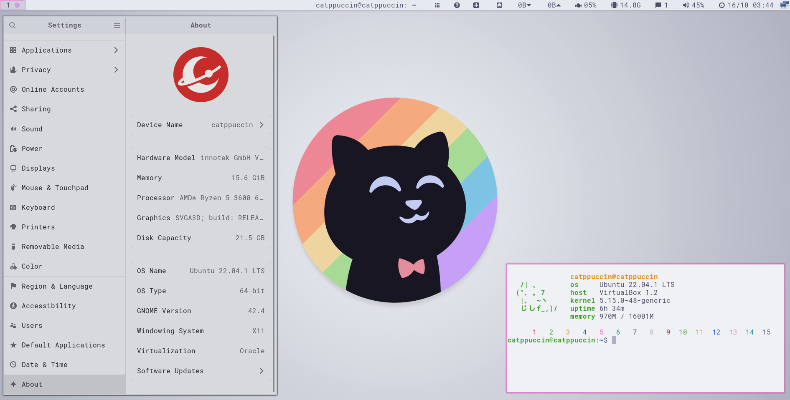
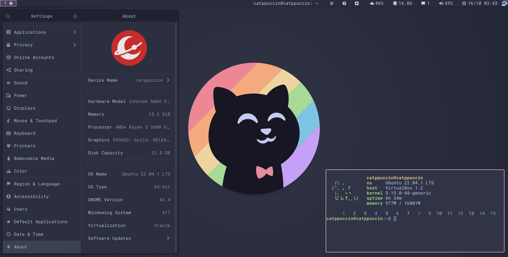
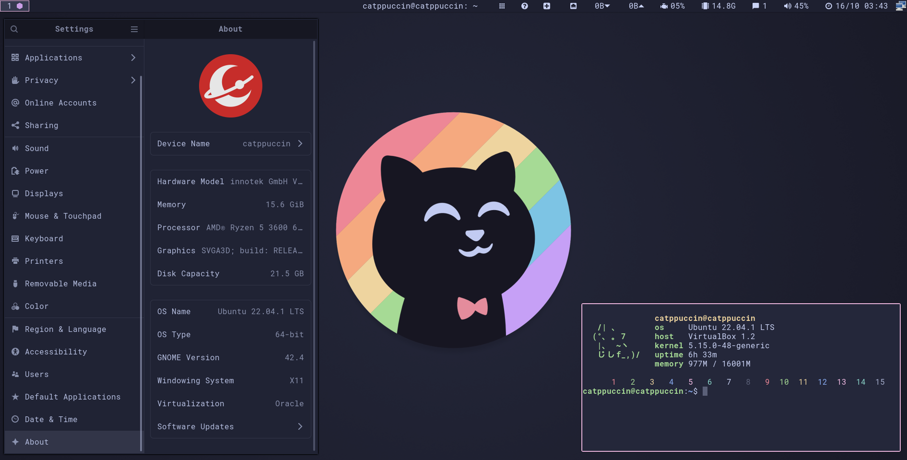
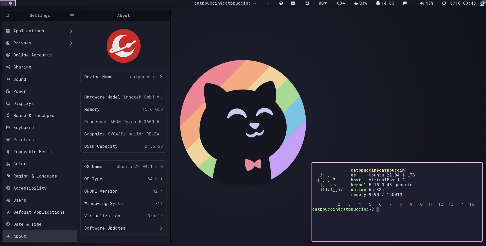

<h3 align="center">
	<br/>
	
	Catppuccin for <a href="https://regolith-desktop.com/">Regolith</a>
	
</h3>

<p align="center">
	<a href="https://github.com/catppuccin/regolith/stargazers"></a>
	<a href="https://github.com/catppuccin/regolith/issues"></a>
	<a href="https://github.com/catppuccin/regolith/contributors"></a>
</p>

<p align="center">
	
</p>

## Previews

<details>
<summary>🌻 Latte</summary>

</details>
<details>
<summary>🪴 Frappé</summary>

</details>
<details>
<summary>🌺 Macchiato</summary>

</details>
<details>
<summary>🌿 Mocha</summary>

</details>

## Usage

1. Clone this repository locally
2. Copy the content of the `catppuccin` folder to `/usr/share/regolith-look/catppuccin`
3. Run `sudo python3 /usr/share/regolith-look/catppuccin/theme-switcher.py --flavour <flavour> --accent <accent>`
4. Run `regolith-look set catppuccin`

## Variables
```shell
! --------------------------------------------
! -- Selected flavour
! --------------------------------------------
#include "/usr/share/regolith-look/catppuccin/config/latte"

! --------------------------------------------
! -- Selected accent
! --------------------------------------------
#define color_accent      color_pink
```
## Dependencies
- [GTK](https://github.com/catppuccin/gtk)
- [Gnome-Terminal](https://github.com/catppuccin/gnome-terminal)

## 📝 TODO

- Gnome terminal themes are still missing.
- Fix the issue regarding GTK3 themes. (The theme is not applied correctly)
- When changing flavours on the fly, workspaces glyph don't update their colours accordingly until logging out / back in

## 💝 Thanks to

- [taka0o](https://github.com/taka0o)

&nbsp;

<p align="center">
	
</p>

<p align="center">
	Copyright &copy; 2021-present <a href="https://github.com/catppuccin" target="_blank">Catppuccin Org</a>
</p>

<p align="center">
	<a href="https://github.com/catppuccin/catppuccin/blob/main/LICENSE"></a>
</p>
